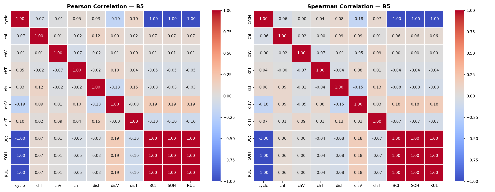
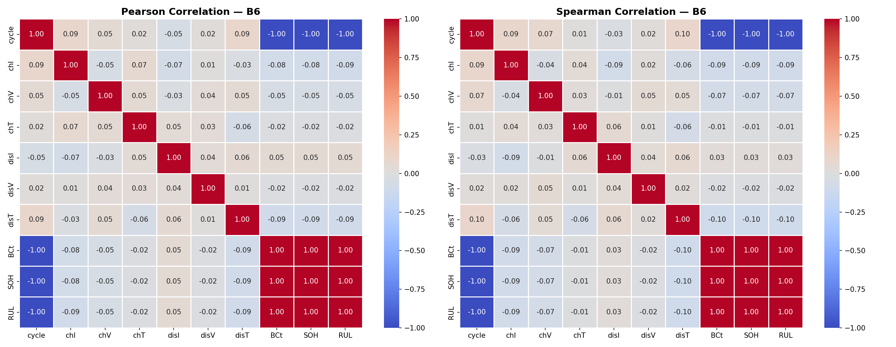
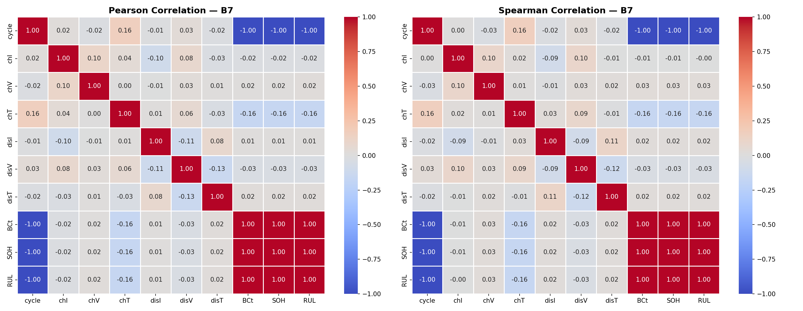
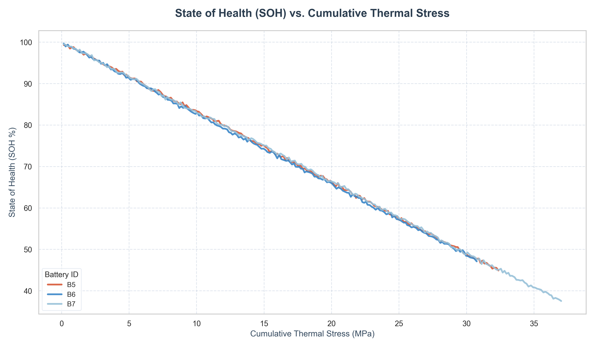

# Analytical Battery Thermal and Stress Analysis Report

This report presents a step-by-step analytical derivation and numerical calculation of heat generation, radial temperature distribution, and thermal stress for an 18650 cylindrical battery cell.

---

## Feature Correlation Maps

To understand the relationships between the operational features (current, voltage, temperature), state variables (SOH, internal resistance), and degradation metrics (RUL), the correlation matrices for Batteries B5, B6, and B7 are presented below:

### Battery B5 Correlation

### Battery B6 Correlation

### Battery B7 Correlation

---

## 1. Physical Parameters of the 18650 Cell

The analysis assumes a standard 18650 cylindrical cell with the following constant parameters defined in the model. These datas are collected from internet:

| Parameter                     | Symbol     | Value               | Unit                               | Description                                     |
| :------------------------------| :-----------| :--------------------| :-----------------------------------| :------------------------------------------------|
| Nominal Open-Circuit Voltage  | $V_{ocv}$  | $3.7$               | $\text{V}$                         | Nominal OCV of the cell                         |
| Internal Resistance           | $R_{int}$  | $0.07$              | $\Omega$                           | Internal electrical resistance                  |
| Outer Radius                  | $R_0$      | $0.009$             | $\text{m}$                         | $9\text{ mm}$ outer radius                      |
| Cell Length                   | $L_{cell}$ | $0.065$             | $\text{m}$                         | $65\text{ mm}$ cell length                      |
| Radial Thermal Conductivity   | $k_r$      | $0.5$               | $\text{W}/(\text{m}\cdot\text{K})$ | Heat conduction coefficient in radial direction |
| Young's Modulus               | $E$        | $10 \times 10^9$    | $\text{Pa}$                        | $10\text{ GPa}$ stiffness modulus               |
| Thermal Expansion Coefficient | $\beta$    | $10 \times 10^{-6}$ | $\text{K}^{-1}$                    | Linear thermal expansion coefficient            |
| Poisson's Ratio               | $\nu$      | $0.3$               | —                                  | Transverse strain ratio                         |

The cell volume $Vol$ is calculated as:
$$Vol = \pi R_0^2 L_{cell} \approx 1.654 \times 10^{-5} \text{ m}^3$$

---

## 2. Heat Generation Rate ($q$)

### Derivation & Formula
During the charging phase, heat is generated inside the cell through two main mechanisms:
1. **Overpotential Heating**: Due to polarization and electrochemical reactions, represented by $I_{ch} (V_{ch} - V_{ocv})$.
2. **Joule (Ohmic) Heating**: Due to internal resistance, represented by $I_{ch}^2 R_{int}$.

The total heat generation rate $q$ (in Watts) is calculated as:
$$q = I_{ch} (V_{ch} - V_{ocv}) + I_{ch}^2 R_{int}$$

where:
- $I_{ch}$ is the charging current (column `chI`)
- $V_{ch}$ is the charging terminal voltage (column `chV`)

### Step-by-Step Plots
The raw heat generation rate vs. cycle for Battery B6 is shown below:

---

## 3. Radial Temperature Profile $T(r)$

### Derivation & Formula
At **steady state**, the cell temperature stops changing with time, meaning $\frac{\partial T}{\partial t} = 0$. The full analytical derivation of the radial temperature profile $T(r)$ under these conditions is detailed below:

#### Step 0: Set $\frac{\partial T}{\partial t} = 0$ in the PDE
We start with the transient heat conduction equation in cylindrical coordinates:
$$\frac{\partial T}{\partial t} = \alpha \left(\frac{\partial^2 T}{\partial r^2} + \frac{1}{r}\frac{\partial T}{\partial r}\right) + \frac{q_{vol}}{\rho \, C_p}$$

where the volumetric heat generation rate is:
$$q_{vol} = \frac{q}{Vol} = \frac{q}{\pi R_0^2 L_{cell}}$$

At steady state, the left-hand side is $0$. We also switch from partial derivatives $\partial$ to ordinary derivatives $d$, since temperature $T$ now depends solely on the radial coordinate $r$:
$$0 = \alpha \left(\frac{d^2 T}{d r^2} + \frac{1}{r}\frac{d T}{d r}\right) + \frac{q_{vol}}{\rho \, C_p}$$

---

#### Step 1: Simplify the PDE
Since thermal diffusivity is defined as $\alpha = \frac{k_r}{\rho \, C_p}$, we can divide the equation by $\alpha$:
$$\frac{q_{vol}}{\rho \, C_p} \div \alpha = \frac{q_{vol}}{\rho \, C_p} \div \frac{k_r}{\rho \, C_p} = \frac{q_{vol}}{k_r}$$

This yields the simplified ordinary differential equation (ODE):
$$\frac{d^2 T}{d r^2} + \frac{1}{r}\frac{d T}{d r} = -\frac{q_{vol}}{k_r} \qquad \cdots (\star)$$

---

#### Step 2: Use the Standard Differential Operator
Using the product rule, we can rewrite the left side of $(\star)$ as a single derivative operator:
$$\frac{d^2 T}{d r^2} + \frac{1}{r}\frac{d T}{d r} = \frac{1}{r}\frac{d}{dr}\left(r\frac{dT}{dr}\right)$$

Substituting this back into $(\star)$ gives:
$$\frac{1}{r}\frac{d}{dr}\left(r\frac{dT}{dr}\right) = -\frac{q_{vol}}{k_r} \qquad \cdots (\star\star)$$

---

#### Step 3: First Integration
Multiply both sides of $(\star\star)$ by $r$:
$$\frac{d}{dr}\left(r\frac{dT}{dr}\right) = -\frac{q_{vol}}{k_r} \cdot r$$

Integrating both sides with respect to $r$ yields:
$$r\frac{dT}{dr} = -\frac{q_{vol} \cdot r^2}{2 k_r} + C_1$$
where $C_1$ is the first constant of integration.

---

#### Step 4: Apply Boundary Condition 1 (Symmetry)
* **BC1**: At $r = 0$ (center of the cylinder), the temperature gradient must be zero by symmetry: $\left.\frac{dT}{dr}\right|_{r=0} = 0$.

Substituting $r=0$ into our integrated equation:
$$0 \cdot 0 = -\frac{q_{vol} \cdot 0}{2 k_r} + C_1 \implies C_1 = 0$$

The equation simplifies to:
$$r\frac{dT}{dr} = -\frac{q_{vol} \cdot r^2}{2 k_r}$$

Dividing both sides by $r$:
$$\frac{dT}{dr} = -\frac{q_{vol} \cdot r}{2 k_r}$$

---

#### Step 5: Second Integration
Integrating $\frac{dT}{dr}$ with respect to $r$ yields the general temperature profile:
$$T(r) = -\frac{q_{vol} \cdot r^2}{4 k_r} + C_2$$
where $C_2$ is the second constant of integration.

---

#### Step 6: Apply Boundary Condition 2 (Surface Temperature)
* **BC2**: At the cell surface $r = R_0$, the temperature matches the measured surface temperature $T_s$: $T(R_0) = T_s$.

Substituting $r = R_0$ and $T(R_0) = T_s$:
$$T_s = -\frac{q_{vol} \cdot R_0^2}{4 k_r} + C_2 \implies C_2 = T_s + \frac{q_{vol} \cdot R_0^2}{4 k_r}$$

---

#### Step 7: Write the Final Temperature Profile
Substituting $C_2$ back into the expression for $T(r)$ and factoring:
$$T(r) = T_s + \frac{q_{vol}}{4 k_r}\left(R_0^2 - r^2\right)$$

This is the final closed-form solution representing the steady-state radial temperature distribution in the cell.

### Step-by-Step Plots
The radial temperature profile $T(r)$ from the center ($r=0$) to the surface ($r=9\text{ mm}$) for Cycle 1 is plotted below:

---

## 4. Core-to-Surface Temperature Difference ($\Delta T$)

### Derivation & Formula
The temperature difference between the cell's center (core) and its surface ($r=R_0$) represents the maximum thermal gradient. Evaluating the temperature profile at $r=0$ gives:
$$\Delta T = T(0) - T(R_0) = \frac{q_{vol} R_0^2}{4 k_r}$$

### Step-by-Step Plots
The core-to-surface temperature difference $\Delta T$ plotted over the cycle life is shown below:

---

## 5. Radial Tangential Thermal Stress Profile $\sigma_\theta(r)$

### Derivation & Formula
For a long, solid cylinder under an axisymmetric temperature distribution $T(r)$, the tangential (hoop) thermal stress profile is derived using thermal elasticity:
$$\sigma_\theta(r) = \frac{E \beta}{1 - \nu} \left[ \frac{1}{R_0^2} \int_0^{R_0} (T(r') - T_s) r' \, dr' + \frac{1}{r^2} \int_0^r (T(r') - T_s) r' \, dr' - (T(r) - T_s) \right]$$

Substituting the temperature profile $T(r) - T_s = A(R_0^2 - r^2)$ where $A = \frac{q_{vol}}{4 k_r}$ and evaluating the integrals:
1. $\int_0^r A(R_0^2 - r'^2) r' \, dr' = A \left[ \frac{R_0^2 r^2}{2} - \frac{r^4}{4} \right]$
2. $\frac{1}{R_0^2} \int_0^{R_0} A(R_0^2 - r'^2) r' \, dr' = A \left[ \frac{R_0^2}{2} - \frac{R_0^2}{4} \right] = \frac{A R_0^2}{4}$
3. $\frac{1}{r^2} \int_0^r A(R_0^2 - r'^2) r' \, dr' = A \left[ \frac{R_0^2}{2} - \frac{r^2}{4} \right]$

Combining these terms:
$$\sigma_\theta(r) = \frac{E \beta}{1 - \nu} \left[ \frac{A R_0^2}{4} + A \left( \frac{R_0^2}{2} - \frac{r^2}{4} \right) - A(R_0^2 - r^2) \right]$$
$$\sigma_\theta(r) = \frac{E \beta}{1 - \nu} \frac{A}{4} \left[ R_0^2 + 2 R_0^2 - r^2 - 4 R_0^2 + 4 r^2 \right]$$
$$\sigma_\theta(r) = \frac{E \beta}{1 - \nu} \frac{A}{4} \left( 3 r^2 - R_0^2 \right)$$

This profile shows that:
- At the core ($r=0$), stress is compressive: $\sigma_\theta(0) = -\frac{E \beta A R_0^2}{4(1 - \nu)}$
- At the surface ($r=R_0$), stress is tensile: $\sigma_\theta(R_0) = \frac{E \beta A R_0^2}{2(1 - \nu)}$

### Step-by-Step Plots
The tangential thermal stress profile $\sigma_\theta(r)$ across the radius at Cycle 1 is plotted below:

---

## 6. Peak Surface Thermal Stress ($\sigma_{\theta, surf}$)

### Derivation & Formula
Evaluating the stress profile at the surface $r = R_0$ gives the peak tangential thermal stress:
$$\sigma_{\theta, surf} = \sigma_\theta(R_0) = \frac{E \beta A R_0^2}{2 (1 - \nu)}$$

Since $A R_0^2 = 4 \Delta T$, this expression simplifies directly to:
$$\sigma_{\theta, surf} = \frac{2 E \beta \Delta T}{1 - \nu} \times \frac{1}{4} = \frac{0.5 E \beta \Delta T}{1 - \nu}$$

This stress is directly proportional to the core-to-surface temperature gradient $\Delta T$.

### Step-by-Step Plots
The peak surface tangential thermal stress vs. cycle is plotted below:

The linear relationship between the peak surface thermal stress and the temperature gradient $\Delta T$ is validated below:

---

## 7. Cumulative Thermal Stress and SOH Degradation

### Derivation & Formula
Thermal fatigue accumulates over the cell's cycle life. The cumulative thermal stress at cycle $N$ is defined as the running sum of the peak surface tangential stresses:

$$\text{Cumulative Stress}_N = \sum_{n=1}^{N} \sigma_{\theta, surf, n}$$

This cumulative metric serves as a proxy for structural micro-damage and correlates strongly with State of Health (SOH) degradation.

### Step-by-Step Plots
The dual axis plot of actual SOH (%) and cumulative thermal stress over the cycle life is shown below:

The correlation between SOH degradation and cumulative thermal stress (with a linear fit) is shown below:

Additionally, a comparison of the SOH vs. Cumulative Thermal Stress profiles for both Battery B5, Battery B6 and Battery B7 shows highly consistent degradation rates as a function of accumulated thermal stress:

