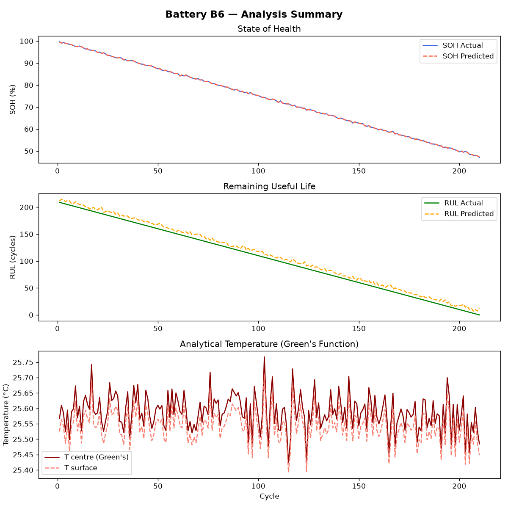
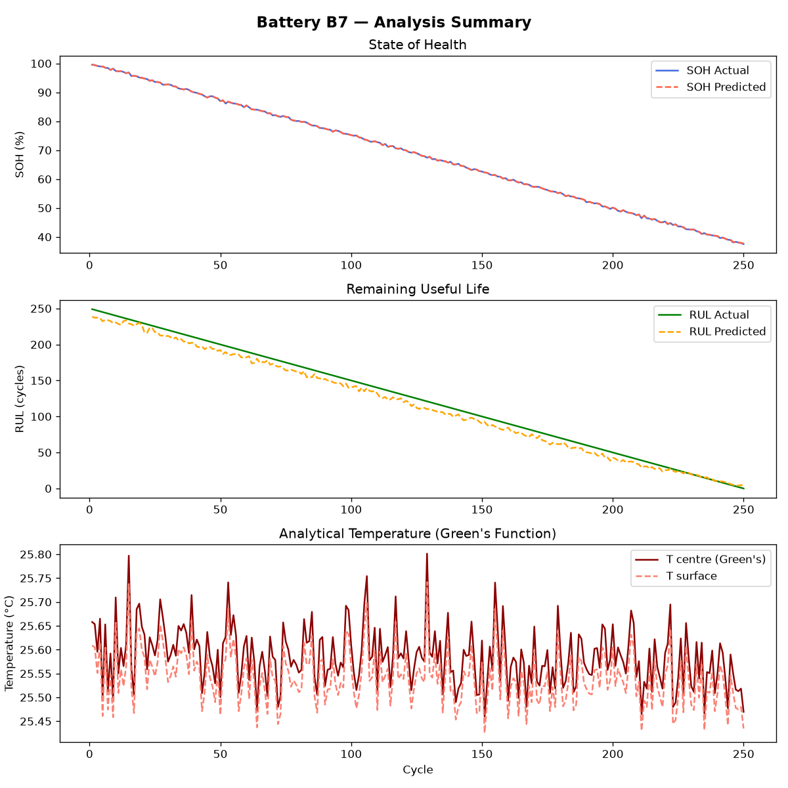

# Battery Health Analysis Pipeline (Tasks 1 & 2)

## Overview

This project consists of two primary components:

1. **Machine Learning Models** for predicting State of Health (SOH) and Remaining Useful Life (RUL).
2. **Analytical Thermal Modeling** using Green's functions to estimate battery core and surface temperatures during operation.

---

# Task 1: SOH and RUL Prediction Using Machine Learning

Machine learning models are developed to predict battery health metrics from cycle-level operating characteristics.

## Input Features

The following variables are used as model inputs:

| Feature | Description                     |
| ------- | ------------------------------- |
| `cycle` | Current cycle number            |
| `chI`   | Average charging current        |
| `chV`   | Average charging voltage        |
| `chT`   | Average charging temperature    |
| `disI`  | Average discharging current     |
| `disV`  | Average discharging voltage     |
| `disT`  | Average discharging temperature |
| `BCt`   | Battery cycle time              |

## Target Variables

The models predict:

* **SOH (State of Health)**
* **RUL (Remaining Useful Life)**

## Methodology

### Data Preprocessing

All input features are standardized using a `StandardScaler` to ensure zero mean and unit variance.

### Model Evaluation

The following regression algorithms are evaluated:

* Random Forest Regressor
* Gradient Boosting Regressor
* K-Nearest Neighbors Regressor (`k = 5`)
* Support Vector Regressor (RBF kernel)

### Validation Strategy

Performance is assessed using **5-fold cross-validation** with the following metrics:

* Mean Absolute Error (MAE)
* Root Mean Squared Error (RMSE)
* Coefficient of Determination ($R^2$)

### Model Selection

The **Random Forest Regressor** demonstrated the best overall predictive performance and was selected to generate the final SOH and RUL estimates.

## Output

* `task1_ml_model_results.csv`
  Cross-validation results containing MAE, RMSE, and $R^2$ scores for all evaluated models.

---

# Task 2: Analytical Thermal Model Based on Green's Functions

An analytical thermal model is implemented to estimate the radial temperature distribution within a cylindrical 18650 lithium-ion cell. The model computes both core and surface temperatures by accounting for internal heat generation, radial heat conduction, and convective heat transfer at the cell boundary.

## Cell Parameters and Assumptions

| Parameter                                   | Value           |
| ------------------------------------------- | --------------- |
| Cell Type                                   | 18650 Li-ion    |
| Radius ($R_0$)                              | 0.009 m         |
| Length ($L$)                                | 0.065 m         |
| Thermal Conductivity ($k$)                  | 0.5 W·m⁻¹·K⁻¹   |
| Density ($\rho$)                            | 2600 kg·m⁻³     |
| Specific Heat Capacity ($c_p$)              | 1000 J·kg⁻¹·K⁻¹ |
| Heat Transfer Coefficient ($h$)             | 10 W·m⁻²·K⁻¹    |
| Internal Resistance ($R_{\text{internal}}$) | 0.005 Ω         |
| Ambient Temperature ($T_{\text{amb}}$)      | 25 °C           |

---

## Mathematical Formulation

### 1. Heat Generation

Heat generation is approximated using Joule heating:

$$
P_{\mathrm{diss}}
=================

I_{\mathrm{discharge}}^2
R_{\mathrm{internal}}
$$

The cylindrical cell volume is given by

$$
V_{\mathrm{cell}}
=================

\pi R_0^2 L
$$

The corresponding volumetric heat generation rate is

$$
\dot{Q}
=======

\frac{P_{\mathrm{diss}}}{V_{\mathrm{cell}}}
\qquad [\mathrm{W/m^3}]
$$

---

### 2. Eigenvalue Calculation

The radial thermal modes are obtained by solving the convective boundary condition at the cell surface ($r = R_0$).

The eigenvalues $\lambda_n$ satisfy

$$
\lambda_n J_1(\lambda_n R_0)
============================

\frac{h}{k}
J_0(\lambda_n R_0)
$$

where:

* $J_0$ is the Bessel function of the first kind (order 0)
* $J_1$ is the Bessel function of the first kind (order 1)
* $h$ is the convective heat transfer coefficient
* $k$ is the thermal conductivity

The first ten eigenvalues ($\lambda_1$ to $\lambda_{10}$) are determined numerically using Brent's root-finding method.

---

### 3. Temperature Solution

The transient temperature field is obtained by superimposing the modal Green's-function responses:

$$
T(r,t)
======

T_{\mathrm{amb}}
+
\int_0^t
\sum_{n=1}^{10}
G_n(r,t-\tau)
, q(\tau)
, d\tau
$$

where:

* $T_{\mathrm{amb}}$ is the ambient temperature
* $G_n$ is the Green's function associated with mode $n$
* $q(\tau)$ is the volumetric heat generation history

Assuming a constant heat-generation rate $\dot{Q}$ over a cycle duration (`BCt`), the integral is evaluated analytically to obtain the temperature at the end of each cycle.

## Output

* `task2_greens_temperature_per_cycle.csv`

  Contains cycle-level results including:

  * Core temperature ($T_{\mathrm{centre}}$)
  * Surface temperature ($T_{\mathrm{surface}}$)
  * Temperature difference ($\Delta T$)
  * Volumetric heat generation rate ($\dot{Q}$)
  * SOH and RUL values

---

# Handover Data (Tasks 3 & 4)

The following datasets are generated for downstream teams:

## Thermal Model Handover

`HANDOVER_task3_thermal_model.csv`

Contains:

* `battery_id`
* `cycle`
* `BCt`
* $\dot{Q}$
* Core temperature
* Surface temperature

## Machine Learning Handover

`HANDOVER_task4_best_models.csv`

Contains the selected model for each target variable together with its performance metrics.

`HANDOVER_task4_predictions.csv`

Contains cycle-level actual and predicted values for:

* SOH
* RUL

---

# Visualizations

Generated figures summarize both machine-learning performance and thermal-model predictions across battery lifetime.

## Battery B5

## Battery B6

## Battery B7

